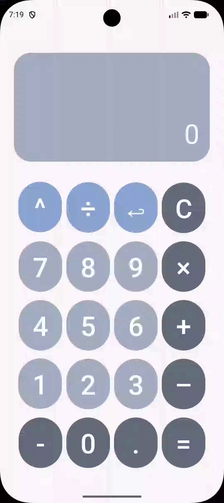

# mini-android-projs
my tiny apps from mobile software development course

## Calculator App @ 09/17
Simple themed calculator app supporting basic operators such as +, −, ×, ÷, and ^. Users can input calculations using the keypad and receive the corresponding result.

  

## Tip Calculator App @ 09/30
Tip calculator that accepts manual bill amount input and returns the total amount based on a selected tip percentage (10%, 15%, or 20%).

